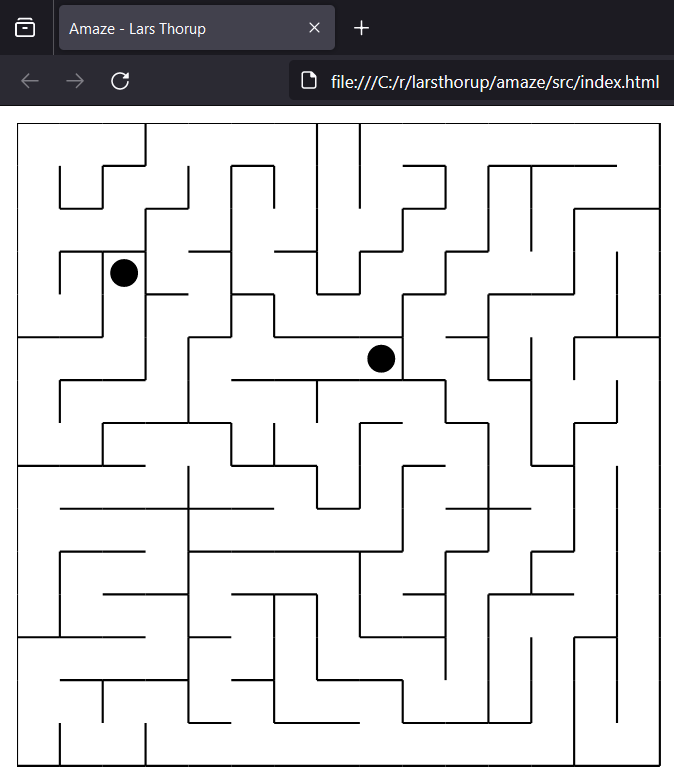

## amaze

[](https://github.com/larsthorup/amaze/actions/workflows/ci.yml)
[](https://coveralls.io/r/larsthorup/amaze?branch=master)
[](https://david-dm.org/larsthorup/amaze#info=dependencies)
[](https://david-dm.org/larsthorup/amaze#info=devDependencies)
[](https://github.com/Flet/semistandard)


Maze generation in isomorphic JavaScript

## TODO

- switch from requirejs to ES6 modules
  - cannot load modules over file:// urls, so must serve over http://
- isomorphic ES6 module mocking? (_.random, _.sample, console.log)
- JSDoc typing

## Getting Started

    npm install
    npm test
    npm start
    npm run serve
    http://127.0.0.1:8080/src/index.html
    http://127.0.0.1:8080/test/index.html

## Sample output



```
+---+---+---+---+---+---+---+---+---+---+---+---+---+---+---+
|       |           |           |                       |   |
+   +   +   +---+   +---+   +   +   +---+---+---+   +   +   +
|   |   |   |       |       |   |               |   |   |   |
+   +   +   +---+   +   +---+   +---+---+   +---+   +   +   +
| x |   |       |       |   |   |           |       |   |   |
+---+   +   +   +---+---+   +   +---+   +---+   +---+   +   +
|       |   |       |       |       |       |       |   |   |
+   +---+   +---+   +   +   +---+   +---+   +---+   +   +   +
|   |   |   |       |   |       |   |       |       |       |
+   +   +   +   +---+   +   +   +   +---+   +   +---+---+   +
|   |   |   |   |       |   |   |       |   |       |       |
+   +   +   +   +   +---+   +   +---+   +   +---+   +   +---+
|   |       |   |   |       |       |   |       |   |   |   |
+   +   +---+   +   +   +---+---+---+   +---+---+   +   +   +
|   |   |       |   |   |               |           |   |   |
+   +   +   +---+   +   +   +---+---+---+   +---+---+   +   +
|   |   |   |   |   |       |               |       |       |
+   +---+   +   +   +---+---+---+---+---+   +   +   +---+   +
|   |       |   |               |           |   |           |
+   +   +---+   +---+---+---+   +   +---+---+   +---+---+---+
|       |   |           |       |   |                   |   |
+---+---+   +   +   +---+   +---+   +---+   +---+---+   +   +
|               |   |       |           |   |       |       |
+   +---+---+---+   +   +---+---+   +   +---+   +   +---+   +
|               |       |       |   |           |   | x |   |
+---+---+---+   +---+---+   +   +---+---+---+---+   +   +   +
|   |       |       |       |   |               |   |   |   |
+   +   +   +---+   +   +---+   +   +---+---+   +   +   +   +
|       |               |           |               |       |
+---+---+---+---+---+---+---+---+---+---+---+---+---+---+---+
```
